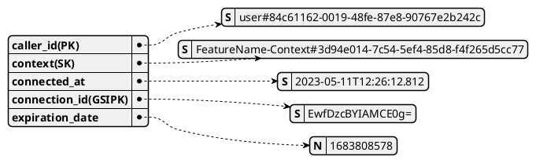
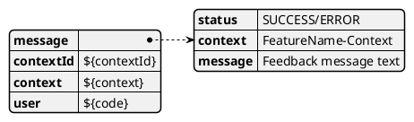

# Definição de contratos

Documento de definição dos contratos a serem utilizados no fluxo de conexão, no armazenamento da sessão do usuário conectado ao websocket e da mensagem de feedback enviada 
ao canal.

  - _**Contrato de conexão do websocket**_
  - _**Contrato de sessão de usuário (modelo de dados no DynamoDB)**_
  - _**Contrato de mensagem para publicação**_


### Contratos

#### Conceitos gerais

  - _**context**_: contexto da mensagem mensagem ou feature origem do envio da mensagem
  - _**contextId**_: identificador da origem da requisição
  - _**caller**_: code do usuário conectado ao websocket


#### 1 - Contrato de conexão do websocket

Por motivos de segurança, para criar uma conexão de websocket, é necessário que o usuário esteja autenticado. O usuário pode ser autorizado pelo cabeçalho `Authorization` ou por um cookie específico contendo o token `authIntegration`.

Os query params `context` e `contextId` são obrigatórios para possibilitar a identificação da conexão pelo backend que faz publicações.

Assim, a url de conexão fica sendo a seguinte:

```
wss:${api-gateway-websocket-endpoint}?context=${context}&contextId=${contextId}
headers:
    Authorization: Bearer ${token}
    ou
    Cookie: authIntegration=${token}
```


#### 2 - Contrato de sessão de usuário (modelo de dados no DynamoDB)

A modelagem do DynamoDB foi feita considerando o envio de mensagens via websocket contemplando diferentes cenários.



  - _**caller_id:**_ identifica quem fez a conexão com o websocket, utilizado o code do usuário, mas pdoe ser extendido para outras entidades ao utilizar um diferente prefixo na chave: `${entity}#${id}`;
 
  - _**context:**_ esta chave é construída da seguinte forma: `${context}#${contextId}`, onde o context identifica o contexto(tela/funcionalidade) e o contextId representa a requisição em que o websocket está sendo utilizado. Inicialmente, o envio de mensagem é feito apenas para uma requisição, mas essa estrutura de chave permite que seja enviado mensagem para múltiplas conexões do mesmo contexto e para múltiplos contextos do mesmo usuário;

  - _**connected_at:**_ data em que a conexão foi estabelecida;

  - _**connection_id:**_ id da conexão que é gerado pelo api gateway. Esse atributo também é uma chave de um GSI para possibilitar buscar o caller pelo id da conexão;

  - _**expiration_date**_: campo utilizado para ttl do DynamoDB, pois não tem necessidade dos dados da sessão serem armazenados por longo prazo, apenas enquanto a conexão fizer sentido existir.


#### 3 - Contrato de mensagem para publicação

A publicação no websocket acontecerá através do envio de uma mensagem para tópico [SNS](https://docs.aws.amazon.com/pt_br/sns/latest/dg/welcome.html) que será criado com o nome `mentor-assist-websocket-publisher`. 

O conteúdo que estiver no corpo da mensagem será publicado no websocket. Além disso, os seguintes atributos de mensagem devem ser enviados:

  - _**context**_
  - _**contextId**_
  - _**caller**_

Ex.: 



