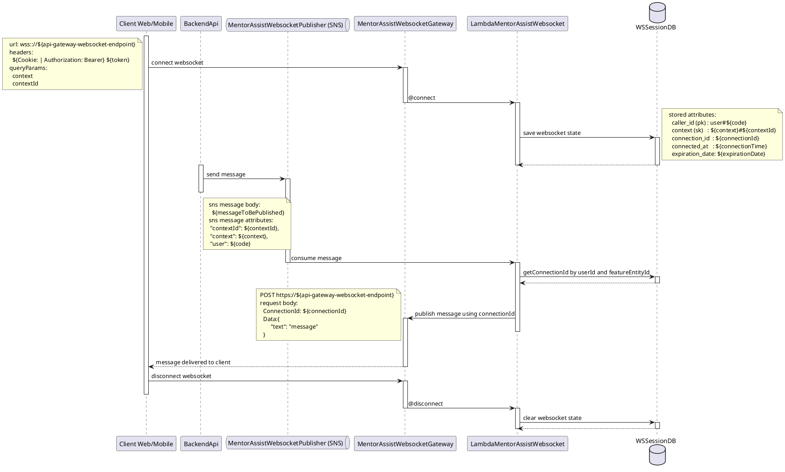

### Diagrama de Contexto - Nível 1

```plantuml
@startuml

participant Client as "Client Web/Mobile"
participant BackendApi
queue       MentorAssistWebsocketPublisher as "MentorAssistWebsocketPublisher (SNS)"
participant MentorAssistWebsocketGateway
participant LambdaMentorAssistWebsocket
database WSSessionDB

activate Client
Client -> MentorAssistWebsocketGateway: connect websocket
note left 
   url: wss:://${api-gateway-websocket-endpoint}
   headers:
     ${Cookie: | Authorization: Bearer} ${token} 
   queryParams:
     context
     contextId
end note

activate MentorAssistWebsocketGateway
MentorAssistWebsocketGateway -> LambdaMentorAssistWebsocket: @connect
deactivate MentorAssistWebsocketGateway

activate LambdaMentorAssistWebsocket
LambdaMentorAssistWebsocket -> WSSessionDB: save websocket state
note right
   stored attributes:
     caller_id (pk) : user#${code}
     context (sk)   : ${context}#${contextId}
     connection_id  : ${connectionId}
     connected_at   : ${connectionTime}
     expiration_date: ${expirationDate}
end note

activate WSSessionDB
LambdaMentorAssistWebsocket <-- WSSessionDB
deactivate WSSessionDB
deactivate LambdaMentorAssistWebsocket

activate BackendApi
BackendApi -> MentorAssistWebsocketPublisher: send message
activate MentorAssistWebsocketPublisher
note right BackendApi
  sns message body:
    ${messageToBePublished}
  sns message attributes:
   "contextId": ${contextId},
   "context": ${context},
   "user": ${code}
end note
deactivate BackendApi

LambdaMentorAssistWebsocket <- MentorAssistWebsocketPublisher: consume message
deactivate MentorAssistWebsocketPublisher

activate LambdaMentorAssistWebsocket
LambdaMentorAssistWebsocket -> WSSessionDB: getConnectionId by userId and featureEntityId
activate WSSessionDB
LambdaMentorAssistWebsocket <-- WSSessionDB
deactivate WSSessionDB

LambdaMentorAssistWebsocket -> MentorAssistWebsocketGateway: publish message using connectionId
note left
 POST https://${api-gateway-websocket-endpoint}
 request body:
   ConnectionId: ${connectionId}
   Data:{
        "text": "message"
   }
end note

activate MentorAssistWebsocketGateway
deactivate LambdaMentorAssistWebsocket

MentorAssistWebsocketGateway --> Client: message delivered to client
deactivate MentorAssistWebsocketGateway
Client -> MentorAssistWebsocketGateway: disconnect websocket
activate MentorAssistWebsocketGateway
deactivate Client

MentorAssistWebsocketGateway -> LambdaMentorAssistWebsocket: @disconnect
deactivate MentorAssistWebsocketGateway
activate LambdaMentorAssistWebsocket
LambdaMentorAssistWebsocket -> WSSessionDB: clear websocket state

activate WSSessionDB
LambdaMentorAssistWebsocket <-- WSSessionDB
deactivate WSSessionDB
deactivate LambdaMentorAssistWebsocket

@enduml
```
